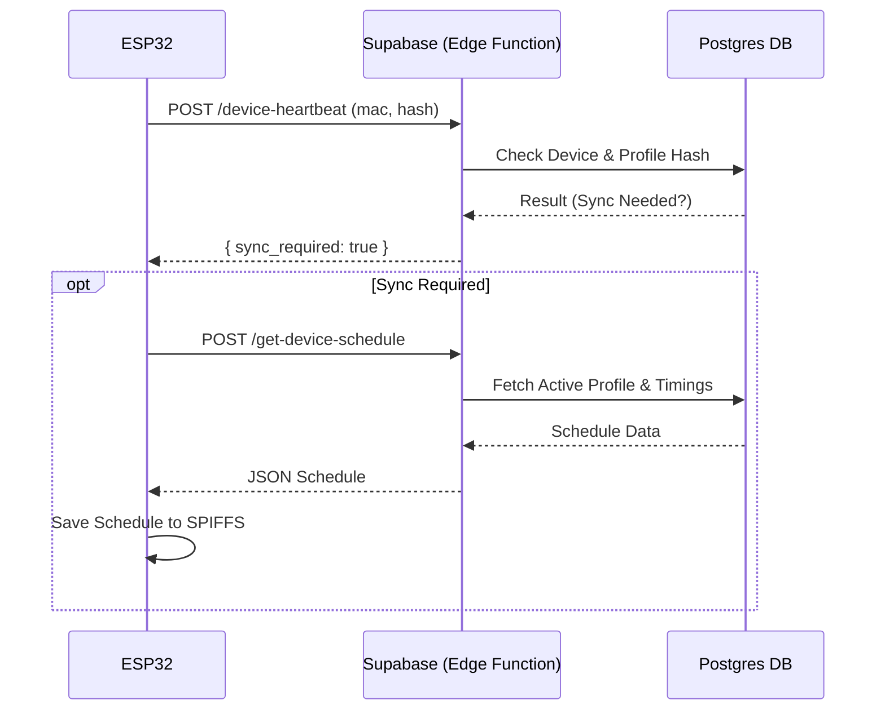
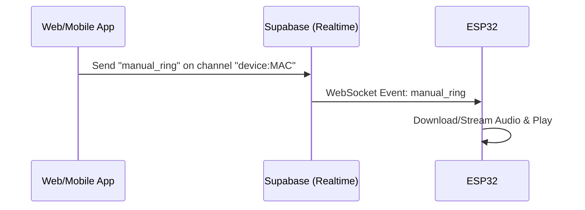

# IoT API Contract

This document defines the communication protocol between the ESP32 AutoBell device and the Supabase backend.

## 1. Communication Overview

The system uses a hybrid communication model:
1.  **Polling (Heartbeat):** The device sends a heartbeat every **60 seconds** to report status and check for configuration updates (via profile hash mismatch).
2.  **Push (Realtime):** The device subscribes to a Supabase Realtime channel for low-latency commands (Manual Ring, Emergency).

## 2. Authentication

The ESP32 device authenticates using its **MAC Address**. 
*   **Method:** All API requests to Edge Functions must include the device's MAC address.
*   **Security:** The Edge Function verifies the MAC address exists in the `public.bell_devices` table before processing the request.
*   **Headers:**
    ```http
    Content-Type: application/json
    Authorization: Bearer <SUPABASE_ANON_KEY>
    x-device-mac: <MAC_ADDRESS>
    ```

## 3. JSON Payload Definitions

### 3.1. Heartbeat (Device -> Backend)

**Endpoint:** `POST /functions/v1/device-heartbeat`

**Request Payload:**
```json
{
  "mac_address": "24:6F:28:A1:B2:C3",
  "uptime": 3600,             // System uptime in seconds
  "wifi_signal": -55,         // RSSI in dBm
  "current_profile_hash": "a1b2c3d4", // Hash of the currently stored schedule
  "status": "online"          // Current device status
}
```

**Response Payload:**
```json
{
  "success": true,
  "sync_required": false,      // true if profile_hash mismatch
  "timestamp": "2023-10-27T10:00:00Z"
}
```

### 3.2. Schedule Sync (Backend -> Device)

**Endpoint:** `POST /functions/v1/get-device-schedule`

**Request Payload:**
```json
{
  "mac_address": "24:6F:28:A1:B2:C3"
}
```

**Response Payload:**
```json
{
  "profile_name": "Regular School Day",
  "profile_hash": "e5f6g7h8", // New hash for the device to store
  "timings": [
    {
      "time": "08:00",       // HH:MM format (24-hour)
      "audio_url": "https://xyz.supabase.co/storage/v1/object/public/bells/morning.mp3",
      "duration": 5          // Duration in seconds
    },
    {
      "time": "10:30",
      "audio_url": "https://xyz.supabase.co/storage/v1/object/public/bells/recess.mp3",
      "duration": 5
    }
  ]
}
```

## 4. Realtime Communication (Push)

The device connects to Supabase Realtime via WebSocket.

**Channel:** `device:<MAC_ADDRESS>`

### 4.1. Events

#### Event: `manual_ring`
Triggered when an operator manually rings a bell.
```json
{
  "event": "manual_ring",
  "payload": {
    "audio_url": "https://xyz.supabase.co/storage/v1/object/public/bells/ding.mp3",
    "duration": 5
  }
}
```

#### Event: `emergency`
Triggered for alarms/emergencies.
```json
{
  "event": "emergency",
  "payload": {
    "type": "fire_alarm",
    "audio_url": "https://xyz.supabase.co/storage/v1/object/public/bells/siren.mp3",
    "duration": 0,       // 0 indicates loop indefinitely until stop command
    "priority": "high"
  }
}
```

#### Event: `stop`
Stops any currently playing audio.
```json
{
  "event": "stop",
  "payload": {}
}
```

## 5. Sequence Diagrams

### 5.1. Boot & Heartbeat Loop



### 5.2. Realtime Command


