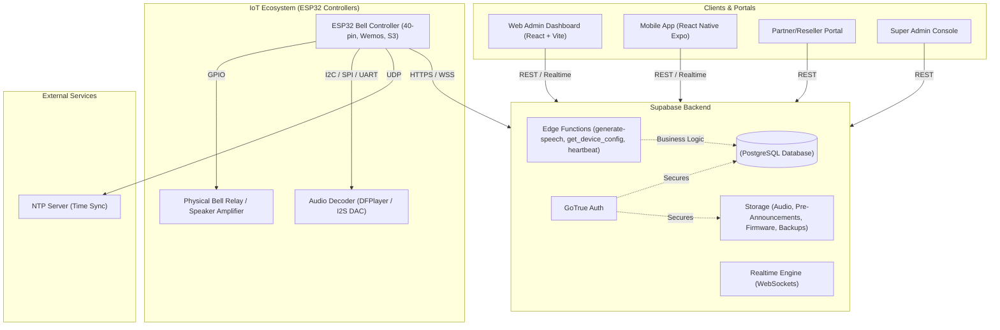

# AutoBell System Architecture

## 1. High-Level Architecture

The AutoBell system is a multi-tenant SaaS IoT solution designed for managing school bells, announcements, and emergency audio alerts. It comprises a React Web Dashboard, a React Native Mobile App, a Partner/Reseller Portal, a Supabase backend, and ESP32-based hardware controllers installed on-site.

### Architecture Diagram



---

## 2. Core Operational Data Flows

### A. Bell Schedule Update & Offline Sync
1. **Schedule Creation:** A School Admin creates or modifies a bell profile (e.g., Normal Day, Exam Day, Ramadan) in the Web or Mobile App.
2. **Persistence:** Schedules are saved to the PostgreSQL `bell_profiles` and `bell_times` tables.
3. **Realtime Push & Polling:** Supabase Realtime notifies the active ESP32 controller. The controller also periodically polls `get_device_config` RPC as a fallback.
4. **Local Cache:** The ESP32 parses the JSON schedule payload and saves it locally into SPIFFS/LittleFS flash memory.
5. **Execution:** The device compares internal time (synced via NTP) against the local schedule file every second. If the internet drops, bells continue to ring seamlessly offline.

### B. Pre-Announcement Audio Jingle & Delay Pipeline
```
+-----------------------------------------------------------------------------------+
|                                Trigger Audio Event                                |
|             (Scheduled Bell / Announcement / TTS / Voice Note / Stream)           |
+-----------------------------------------------------------------------------------+
                                          |
                                          v
+-----------------------------------------------------------------------------------+
|                        Check School Pre-Announcement Config                       |
|   (pre_announcement_enabled, pre_announcement_url, pre_announcement_delay_seconds) |
+-----------------------------------------------------------------------------------+
                                          |
                     +--------------------+--------------------+
                     | Enabled                                 | Disabled
                     v                                         v
+------------------------------------------+ +----------------------------------+
| 1. Play Pre-Announcement MP3 Sound       | | Play Primary Audio Content        |
| 2. Pause Delay (2 to 5 Seconds)          | | (Bell / TTS / Voice Note / Stream)
| 3. Play Primary Audio Content            | +----------------------------------+
+------------------------------------------+
```
1. Before any primary audio (bell ring, TTS spoken notice, voice note, or announcement) plays, the controller checks its `DeviceConfig` for pre-announcement parameters.
2. If `pre_announcement_enabled` is true, the ESP32 plays the school's configured pre-announcement audio jingle from the `pre-announcements` public storage bucket.
3. Upon jingle playback completion, the firmware executes a non-blocking pause delay for the configured duration (between 2 and 5 seconds).
4. The system then plays the primary audio payload.

### C. Emergency Trigger Priority Flow
1. An authorized user slides the **Activate Emergency** trigger on the Mobile or Web App.
2. The request writes high-priority commands to `command_queue` and broadcasts a WebSocket message via Supabase Realtime.
3. Target ESP32 controllers immediately interrupt any running audio, override standard schedules, and trigger continuous emergency alarm signals.

### D. System Backup & Restore Pipeline
1. **Backup Creation:** Admins trigger a full backup via `SchoolBackups.tsx` or `SuperAdminBackups.tsx`.
2. **Data Packaging:** Backend RPCs aggregate all active profiles, schedule bell times, device configurations, diagnostic logs, and uploaded MP3 metadata into a structured JSON manifest file.
3. **Storage:** The manifest file and referenced MP3 media files are bundled and saved securely in dedicated Supabase storage buckets.
4. **Restoration:** Importing a backup manifest allows instant disaster recovery or effortless system setup for new campus hardware.

---

## 3. Security & Multi-Tenancy Strategy

### Role-Based Access Control (RBAC)
*   **Super Admin:** SaaS Platform Owner level. Manages school subscriptions, serial inventory claiming, global pre-announcement audio libraries, platform-wide user roles, partner networks, and system backups.
*   **School Admin:** Full control over school profile schedules, period bells, MP3 audio management, pre-announcement settings, device claiming, and operator user invitations.
*   **Operator:** Restricted operational access. Allowed to issue manual bell rings, announcements, and emergency alarms, but cannot modify schedules or school settings.
*   **Partner:** Reseller & Distributor portal access. Manages prospective leads, client deals, payment tracking, commission summaries, and customer onboarding.

### Multi-Tenant Isolation
*   Every table record contains a `school_id` foreign key.
*   PostgreSQL **Row Level Security (RLS)** policies strictly isolate data across schools.
*   Devices authenticate using hardware MAC addresses combined with secure device JWTs issued during setup.

---

## 4. Hardware Reliability Features

*   **Hardware Watchdog:** Internal timer continuously monitored by the firmware loop. If the CPU freezes or encounters a dead-lock, the watchdog hardware forces a clean system reboot within seconds.
*   **Over-The-Air (OTA) Updates:** Firmware images stored in protected Supabase buckets allow HTTPS OTA firmware upgrades without physical hardware intervention.
