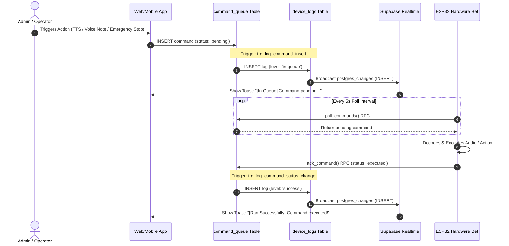

# AutoBell Comprehensive Notification Strategy & Suggestions Guide

This document outlines the architecture, sequence workflows, event matrices, and future roadmap suggestions for real-time notifications and activity tracking across the **AutoBell IoT Smart School Bell & Audio Broadcast System**.

---

## 1. Executive Summary & Objectives

In an IoT campus audio management system like AutoBell, real-time feedback is critical. When a school administrator or operator broadcasts an announcement (`TTS`), sends a voice note (`VOICE_NOTE`), triggers a bell ring (`RING`), or initiates an emergency stop (`EMERGENCY_STOP`), they must have full visibility into the execution lifecycle:

1. **Submission & Queuing (`[In Queue]`)**: Instant confirmation that the command was successfully stored in the cloud database (`command_queue` table with `status = 'pending'`).
2. **Execution & Completion (`[Ran Successfully]`)**: Real-time confirmation from the physical ESP32 bell hardware (via the `ack_command` RPC) that the command was fetched, decoded, and played/executed (`status = 'executed'`).
3. **Error Handling (`[Error]`)**: Instant alert if a device is offline, offline during queue timeout, or encounters an audio playback error.

---

## 2. Current Implementation Architecture

### 2.1 End-to-End Event Lifecycle Sequence Workflow



### 2.2 Database Triggers (`supabase/migrations/20260720203500_add_command_execution_notifications.sql`)
- **`trg_log_command_insert`**: Intercepts command creation and immediately writes `level = 'in queue'` logs to `device_logs`, capturing the user ID, command type, and readable text payload.
- **`trg_log_command_status_change`**: Monitors updates to `command_queue` where `status` changes to `'executed'`. It automatically generates a `level = 'success'` entry in `device_logs`.

### 2.3 Web Dashboard Notification System (`DashboardLayout.tsx` & `Overview.tsx`)
- **Global Toast Bar (`DashboardLayout.tsx`)**: Subscribes directly to `INSERT` events on `device_logs` via Supabase Real-Time. Banners feature visual indicators:
  - 🟨 **Amber / Clock Icon (`In Queue`)**: E.g., `"[In Queue] TTS Broadcast queued by admin@school.edu: 'Good morning students'"`
  - 🟩 **Emerald / Check Icon (`Ran Successfully`)**: E.g., `"[Ran Successfully] TTS Broadcast executed on Primary Campus Bell"`
  - 🟥 **Red / Alert Icon (`Error`)**: E.g., `"Execution failed or device unreachable"`
- **Header Notification Center (`DashboardLayout.tsx`)**: Maintains a list of the 50 most recent notifications with unread counter badges, timestamps, and quick action buttons (`Mark all read`, `Clear all`).
- **Live Activity Feed (`Overview.tsx`)**: Displays an interactive real-time stream of device events directly on the main dashboard overview card.

---

## 3. Comprehensive Event & Notification Matrix

| Event Category | Command / Action | Trigger Condition | Notification Level | Default Channels | Target Roles |
| :--- | :--- | :--- | :--- | :--- | :--- |
| **TTS Broadcast** | `TTS` | Queued (`pending`) | `In Queue` (`amber`) | Toast, Notification Center, Activity Feed | Admin, Operator |
| **TTS Broadcast** | `TTS` | Executed (`executed`) | `Ran Successfully` (`green`) | Toast, Notification Center, Activity Feed | Admin, Operator |
| **Voice Note** | `VOICE_NOTE` / `PLAY_URL` | Queued (`pending`) | `In Queue` (`amber`) | Toast, Notification Center, Activity Feed | Admin, Operator |
| **Voice Note** | `VOICE_NOTE` / `PLAY_URL` | Executed (`executed`) | `Ran Successfully` (`green`) | Toast, Notification Center, Activity Feed | Admin, Operator |
| **Live Audio Stream** | `STREAM_START` | Queued & Executed | `In Queue` / `Success` | Toast, Notification Center, Activity Feed | Admin, Operator |
| **Stream Stop** | `STREAM_STOP` | Queued & Executed | `In Queue` / `Success` | Toast, Notification Center, Activity Feed | Admin, Operator |
| **Manual Bell Ring** | `RING` | Queued & Executed | `In Queue` / `Success` | Toast, Notification Center, Activity Feed | Admin, Operator |
| **Emergency Stop** | `EMERGENCY_STOP` | Queued / Executed | `Critical / Success` | **All Channels + Urgent Toast** | Admin, Operator, User |
| **Volume Adjustment**| `SET_VOLUME` | Queued & Executed | `In Queue` / `Success` | Toast, Activity Feed | Admin, Operator |
| **Scheduled Bell** | `SCHEDULED_RING` | Auto-triggered | `Info` / `Success` | Activity Feed, Notification Center | Admin |
| **Device Offline Alert** | Heartbeat check | `online` ──► `offline` | `Warning / Error` | Toast, Notification Center, Activity Feed | Admin |
| **Firmware OTA** | `OTA_UPDATE` | Started & Completed | `Info` / `Success` | Notification Center, Super Admin Dashboard | Super Admin, Admin |

---

## 4. In-Depth Technical Roadmap & Suggestions

### 4.1 Mobile Push Notifications (FCM / APNs via Expo)
For administrators away from their computers:
- **Expo Notifications Integration**: Configure Expo Server SDK inside a Supabase Edge Function triggered by `device_logs` for critical events.
- **Urgent Scenarios**:
  - **Emergency Stop**: Send high-priority push notifications with custom sound alerts when `EMERGENCY_STOP` is triggered.
  - **Offline Alert Threshold**: If a device fails to check in for >10 minutes during school hours, send a push notification:
    *“🚨 Primary Campus Bell is Offline! Check power & Wi-Fi connection.”*

#### Proposed Supabase Edge Function (`push-notifications`):
```typescript
import { serve } from "https://deno.land/std@0.168.0/http/server.ts"

serve(async (req) => {
  const { record } = await req.json()
  
  if (record.level === 'error' || record.message.includes('EMERGENCY_STOP')) {
    // Send to FCM via Expo API
    await fetch('https://exp.host/--/api/v2/push/send', {
      method: 'POST',
      headers: { 'Content-Type': 'application/json' },
      body: JSON.stringify({
        to: record.push_token,
        sound: 'default',
        title: '🚨 AutoBell Critical Alert',
        body: record.message,
        priority: 'high'
      })
    })
  }
  return new Response(JSON.stringify({ success: true }), { headers: { 'Content-Type': 'application/json' } })
})
```

### 4.2 Webhook & Team Messaging Integrations (Slack / Discord / Microsoft Teams)
- **Outbound Webhooks**: Allow administrators to configure webhook URLs in School Settings.
- **Daily Activity Summary**: Automatically compile and post a end-of-day summary at 5:00 PM:
  *“📅 AutoBell Daily Report: 24 scheduled bells rang on time. 3 announcements broadcasted. All 4 campus devices operating normally.”*

#### Example Webhook Payload (Slack Format):
```json
{
  "text": "🚨 *AutoBell Alert: EMERGENCY_STOP Triggered*",
  "blocks": [
    {
      "type": "section",
      "text": {
        "type": "mrkdwn",
        "text": "*Emergency Stop Actioned*\n*User:* admin@school.edu\n*Devices Silenced:* 4/4 Campus Bells\n*Status:* Executed"
      }
    }
  ]
}
```

### 4.3 Granular Notification Preferences Schema
To allow users to control notification frequency and prevent alert fatigue, introduce a `notification_preferences` table:

```sql
CREATE TABLE public.notification_preferences (
    id UUID PRIMARY KEY DEFAULT gen_random_uuid(),
    user_id UUID REFERENCES auth.users(id) ON DELETE CASCADE,
    notify_tts BOOLEAN DEFAULT true,
    notify_voice_note BOOLEAN DEFAULT true,
    notify_emergency BOOLEAN DEFAULT true,
    notify_device_offline BOOLEAN DEFAULT true,
    channel_in_app BOOLEAN DEFAULT true,
    channel_email BOOLEAN DEFAULT false,
    channel_push BOOLEAN DEFAULT true,
    created_at TIMESTAMPTZ DEFAULT now()
);
```

### 4.4 Smart Deduplication & Quiet Hours Silencing
- **Deduplication Window**: If 5 identical volume adjustments or test bells occur within 10 seconds, condense them into a single summary notification (`"Volume updated across 4 devices"`).
- **Quiet Hours Suppression**: Non-critical system notifications (e.g., routine NTP time syncs) should remain silent during designated school quiet hours or nighttime.

---

## 5. Deployment Verification Checklist

- [x] Database Trigger `trg_log_command_insert`: Captures `[In Queue]` status with user attribution and payload text.
- [x] Database Trigger `trg_log_command_status_change`: Captures `[Ran Successfully]` status automatically upon ESP32 hardware ACK.
- [x] Real-Time Toast Banners (`DashboardLayout.tsx`): Displays color-coded real-time feedback for queued and executed actions.
- [x] Header Notification Center (`DashboardLayout.tsx`): Stores history, handles read/unread states, and persists across navigation.
- [x] Live Activity Feed (`Overview.tsx`): Displays real-time device logs with contextual icons (`Megaphone`, `Mic`, `Play`, `Clock`, `CheckCircle`, `AlertTriangle`).
- [x] Queuing Clarity across Web & Mobile: Status dialogs clearly distinguish between `[In Queue]` and `[Ran Successfully]`.
